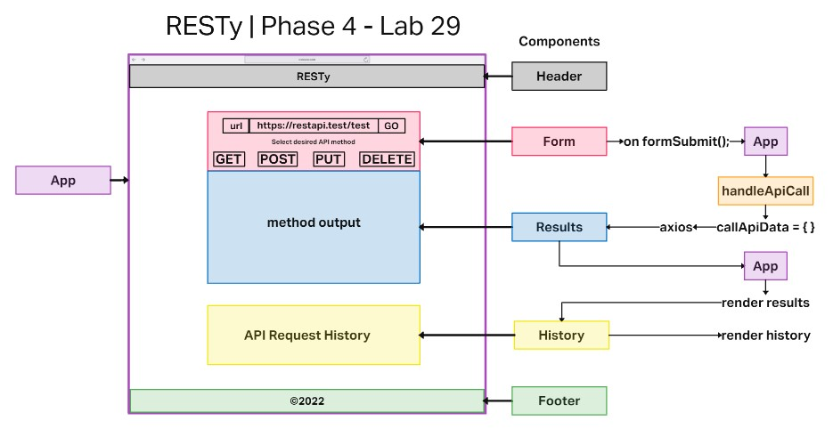
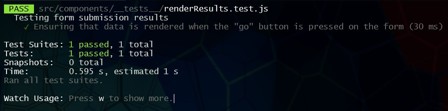
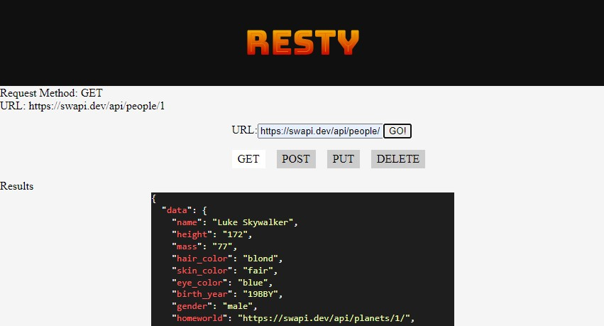
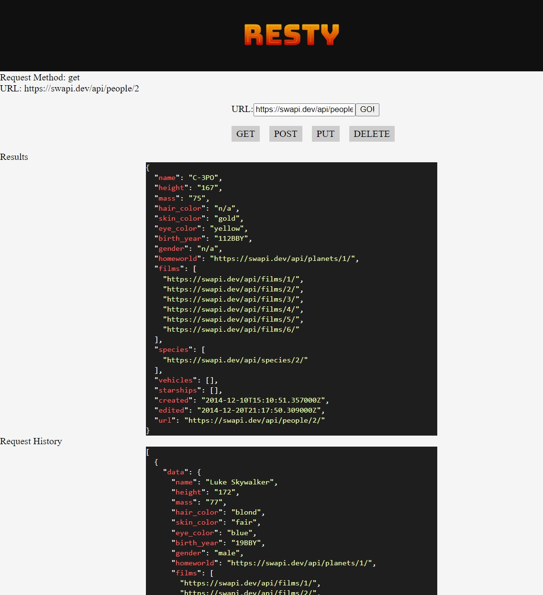
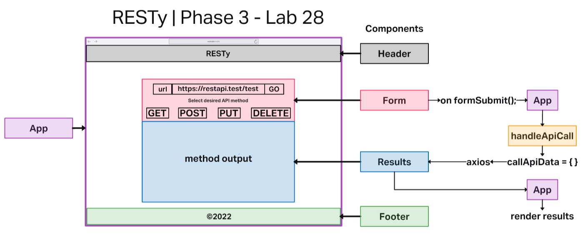
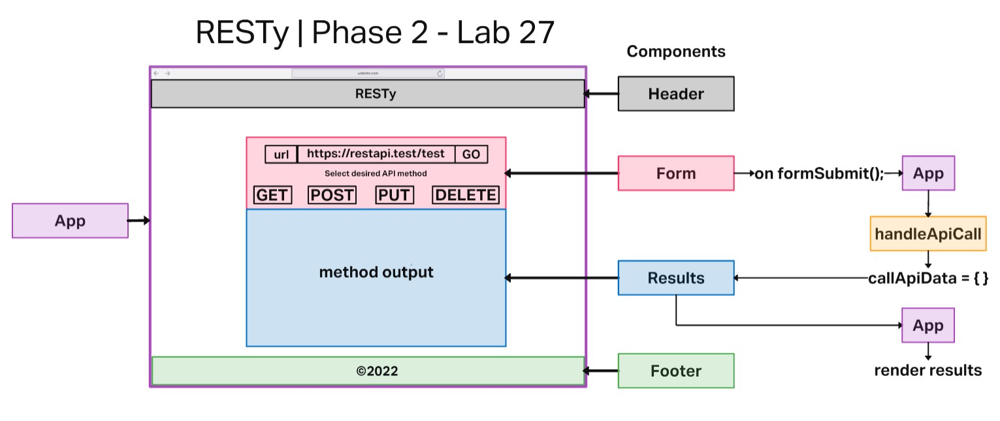
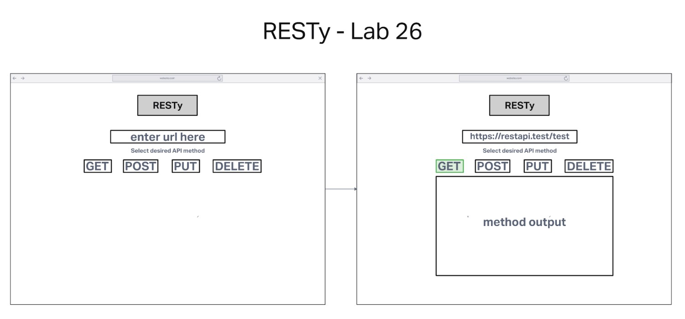

# RESTy API Tester

## Code 401d48 lab 26-29

## Author: Robert Ball

### built upon the starter code located [Seattle Code Javascript-401d48](https://github.com/codefellows/seattle-code-javascript-401d48/tree/main/class-26/lab/starter-code)

---

### Phase 4 live on [codesandbox.io](https://codesandbox.io/p/github/RDBALL/resty/lab29?file=%2FREADME.md&workspace=%257B%2522activeFileId%2522%253A%2522cl9n5pr7d0000lscm7ext4sft%2522%252C%2522openFiles%2522%253A%255B%255D%252C%2522sidebarPanel%2522%253A%2522EXPLORER%2522%252C%2522gitSidebarPanel%2522%253A%2522COMMIT%2522%252C%2522sidekickItems%2522%253A%255B%257B%2522key%2522%253A%2522cl9rwdfcv00i2356hjuvk1p8v%2522%252C%2522type%2522%253A%2522PROJECT_SETUP%2522%252C%2522isMinimized%2522%253Afalse%257D%252C%257B%2522type%2522%253A%2522TASK_LOG%2522%252C%2522taskId%2522%253A%2522start%2522%252C%2522key%2522%253A%2522cl9rwdh3t00n6356hguxvme2n%2522%252C%2522isMinimized%2522%253Afalse%257D%255D%257D)

### Phase 3 live on [codesandbox.io](https://codesandbox.io/p/github/RDBALL/resty/lab28?file=%2FREADME.md&workspace=%257B%2522activeFileId%2522%253A%2522cl9n5pr7d0000lscm7ext4sft%2522%252C%2522openFiles%2522%253A%255B%255D%252C%2522sidebarPanel%2522%253A%2522EXPLORER%2522%252C%2522gitSidebarPanel%2522%253A%2522COMMIT%2522%252C%2522sidekickItems%2522%253A%255B%257B%2522type%2522%253A%2522PREVIEW%2522%252C%2522taskId%2522%253A%2522start%2522%252C%2522port%2522%253A3000%252C%2522key%2522%253A%2522cl9q82vum00j8356h963x75u8%2522%252C%2522isMinimized%2522%253Afalse%257D%252C%257B%2522type%2522%253A%2522TASK_LOG%2522%252C%2522taskId%2522%253A%2522start%2522%252C%2522key%2522%253A%2522cl9q82qwm00h7356h6hjwr7z4%2522%252C%2522isMinimized%2522%253Afalse%257D%255D%257D)

### Phase 2 live on [codesandbox.io](https://codesandbox.io/p/github/RDBALL/resty/lab27?file=%2FREADME.md&workspace=%257B%2522activeFileId%2522%253A%2522cl9n5pr7d0000lscm7ext4sft%2522%252C%2522openFiles%2522%253A%255B%255D%252C%2522sidebarPanel%2522%253A%2522EXPLORER%2522%252C%2522gitSidebarPanel%2522%253A%2522COMMIT%2522%252C%2522sidekickItems%2522%253A%255B%257B%2522type%2522%253A%2522PREVIEW%2522%252C%2522taskId%2522%253A%2522start%2522%252C%2522port%2522%253A3000%252C%2522key%2522%253A%2522cl9ot75vl00mw356i5nn1k6fj%2522%252C%2522isMinimized%2522%253Afalse%257D%252C%257B%2522type%2522%253A%2522TASK_LOG%2522%252C%2522taskId%2522%253A%2522start%2522%252C%2522key%2522%253A%2522cl9ot726300kv356iwuny1k4n%2522%252C%2522isMinimized%2522%253Afalse%257D%255D%257D)

### Phase 1 live on [codesandbox.io](https://codesandbox.io/p/github/RDBALL/resty/lab26?selection=%5B%7B%22endColumn%22%3A1%2C%22endLineNumber%22%3A12%2C%22startColumn%22%3A1%2C%22startLineNumber%22%3A12%7D%5D&file=%2FREADME.md&workspace=%257B%2522activeFileId%2522%253A%2522cl9n5pr7d0000lscm7ext4sft%2522%252C%2522openFiles%2522%253A%255B%255D%252C%2522sidebarPanel%2522%253A%2522EXPLORER%2522%252C%2522gitSidebarPanel%2522%253A%2522COMMIT%2522%252C%2522sidekickItems%2522%253A%255B%257B%2522type%2522%253A%2522PREVIEW%2522%252C%2522taskId%2522%253A%2522start%2522%252C%2522port%2522%253A3001%252C%2522key%2522%253A%2522cl9nfhe6g00el376hmikh4kx6%2522%252C%2522isMinimized%2522%253Afalse%257D%252C%257B%2522type%2522%253A%2522TASK_LOG%2522%252C%2522taskId%2522%253A%2522start%2522%252C%2522key%2522%253A%2522cl9n5vdru00tc376h345pqhch%2522%252C%2522isMinimized%2522%253Afalse%257D%255D%257D)

---
Documentation:



---

## Problem Domain

* Our application will be an API testing tool that can be run in any browser, allowing a user to easily interact with APIs in a familiar interface.

---

## Phase 1 - Requirements

* Today, we begin the first of a 4-Phase build of the RESTy application, written in React. In this first phase, our goal is to setup the basic scaffolding of the application, with intent being to add more functionality to the system as we go. This initial build sets up the file structure so that we can progressively build this application in a scalable manner

---
Requirements:

Refactor the RESTy application as follows:

* Convert all child components of App.js from classes to functions
  * The App component serves as the container for all sub-components of this application.
  * Leave this component as a Class.
  * Make sure all base styles for App are included in a .scss imported within App.js.
  * Ensure that the Header, Footer, Results and Form components are imported using ES6 import syntax.
* Use .scss files to style each component
  * Each of the components use their own .scss file for styling.
* Core application functionality should remain unchanged:
  * The `<Form>` component should:
  * Call a function on submit that updates the `<App/>` component via a function sent down as a prop so that the app can process the form values.
  * The `<Results/>` component should show mock API results.

---

## Phase 2 - Requirements

* In phase 2, we will be receiving user input in preparation of connecting to live APIs, using the useState() hook in our functional components. In order to properly manage state with the useState hook, we will now convert App.js to a functional component.

* The following user stories detail the major functionality for this phase of the project.

  * As a user, I want to enter the REST Method and URL to an API
  * As a user, I want to see a summary of my request as well as results returned from an API request in my browser in a readable format

### Tests

* Install the React Testing Library framework
* Assert that upon submitting the form will result in data being rendered in the output area
* Install the GitHub action that will auto-run your tests on all check-ins



```js
describe('Testing form submission results', () => {
  it('Ensuring that data is rendered when the "go" button is pressed on the form', () => {
    render(<App />);
    let formSubmitButton = screen.getByTestId('formSubmitButton');
    fireEvent.click(formSubmitButton);
    let returnResults = screen.getByTestId('returnResults');

    expect(returnResults).toHaveTextContent(/.*/);
  });
})
```

---

## Phase 3 - Requirements

* In phase 3, we will be connecting RESTy to live APIs, fetching and displaying remote data. Our primary focus will be to service GET requests

* The following user stories detail the major functionality for this phase of the project.

  * As a user, I want to enter the URL to an API and issue a GET request so that I can retrieve it’s data
  * As a user, I want to see the results returned from an API request in my browser in a readable format

* Application Flow:

  * User enters an API URL
  * Chooses a REST Method
  * Clicks the “Go” button
  * Application fetches data from the URL given, with the method specified
  * Displays the response headers and results separately
  * Both headers and results should be “pretty printed” JSON

---

### Application 'get' request from API URL

> 

---

## Phase 4 - Requirements

* In phase 4, we will be tracking every API call and storing it in history

* The following user stories detail the major functionality for this phase of the project.

  * As a user, I want to see a list of my previous API calls, so that I can see the results again, quickly

### API request history 

> 

Dependencies

```JSON
{
    "@testing-library/jest-dom": "^5.16.5",
    "@testing-library/react": "^13.4.0",
    "@testing-library/user-event": "^13.5.0",
    "axios": "^1.1.3",
    "bootstrap": "^5.2.2",
    "msw": "^0.47.4",
    "react": "^18.2.0",
    "react-bootstrap": "^2.5.0",
    "react-dom": "^18.2.0",
    "react-json-pretty": "^2.2.0",
    "react-jsonschema-form": "^1.8.1",
    "react-scripts": "5.0.1",
    "sass": "^1.55.0",
    "web-vitals": "^2.1.4"
}
```

Setup

* npx create-react-app on your local machine
* delete the src folder and the package.json file from your local machine.
* copy the src and package.json from this repo into your local React app
* install required dependencies with npm i

---

Previous UMLs

  


